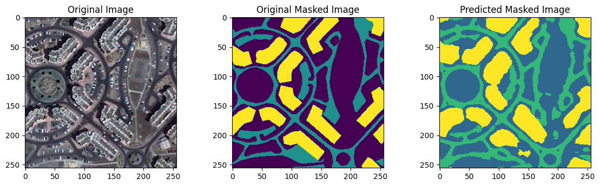
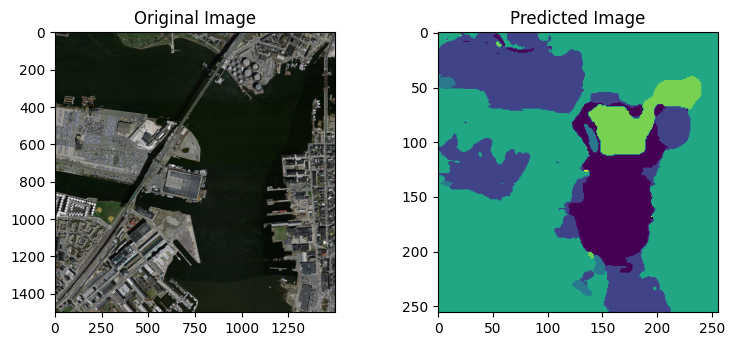
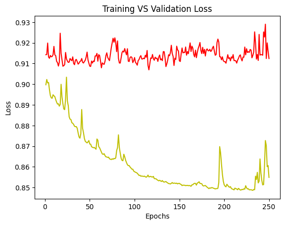

# Change Detection Due to Human Activities

## Overview
This project focuses on developing an automated system to detect changes caused by human activities using satellite imagery. The AI/ML-based model identifies changes in man-made objects such as vehicles, buildings, roads, and aircraft using remote sensing images from Sentinel-2 and LISS-4 datasets.

## Features
- **AI-Powered Change Detection**: Leveraging advanced AI/ML techniques for accurate detection.
- **Focus on Man-Made Objects**: Detection of vehicles, buildings, roads, etc.
- **Comprehensive Visualization**: Clear output of changes through original images, ground truth masks, and predictions.

## Model Development

### Data Collection and Preprocessing
- **Datasets**: Sentinel-2 and LISS-4 satellite imagery.
- **Preprocessing Steps**:
  - Resize and normalize images.
  - Segment images into patches for focused analysis.

### Model Architecture
- **Base Model**: Modified U-Net optimized for semantic segmentation.
- **Components**:
  - Convolutional layers with dropout regularization.
  - Transposed convolutional layers for upsampling.
  - Softmax activation for pixel-wise probability distribution.

### Training and Evaluation
- **Loss Functions**: Dice loss and Focal loss.
- **Optimizer**: Adam optimizer.
- **Metrics**: Accuracy and Jaccard Coefficient (IoU).
- **Training**: Performed on a subset of the dataset with validation for performance assessment.

## Results
The trained model effectively detects changes in man-made objects, demonstrated through:
- **Original Images**
- **Ground Truth Masks**
- **Predicted Masks**

## Example Images
### Working


### Original -> Predicted


### Training and Validation Loss 


## Applications
- **Urban Planning**: Monitoring urban development and infrastructure.
- **Environmental Monitoring**: Tracking land use changes and deforestation.
- **Disaster Response**: Assessing damage after natural disasters.

## Getting Started
1. **Clone the Repository**:
   ```bash
   git clone https://github.com/yourusername/repository-name.git
   ```

2. **Install Dependencies**:
   Ensure Python and required libraries are installed.
   ```bash
   pip install -r requirements.txt
   ```

3. **Run the Model**:
   ```bash
   python main.py
   ```

## Contributing
Contributions are welcome! Feel free to open an issue or submit a pull request.

## License
This project is licensed under the MIT License.

---

**Note**: Replace placeholders like `images/original_image.jpg` with the actual file paths in your repository.
